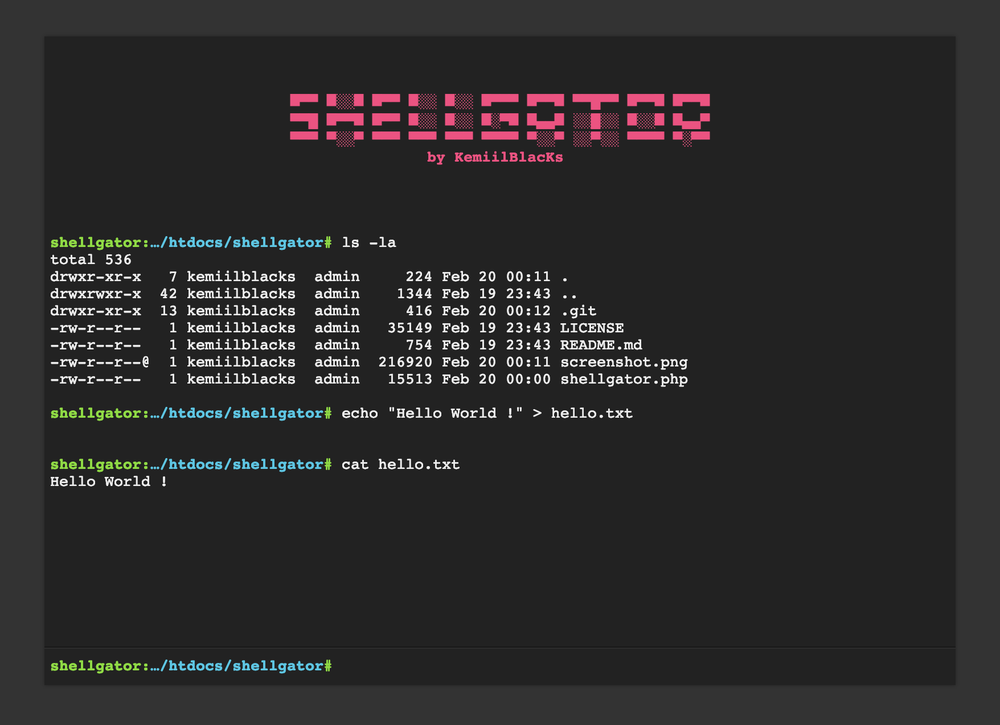

# shellgator
shellgator is a single file PHP shell

shellgator is a very basic, single-file, PHP shell. It can be used to quickly execute commands on a server when pentesting a PHP application. Use it with caution: this script represents a security risk for the server.

**Features:**

* Command history (using arrow keys `↑` `↓`)
* Auto-completion of command and file names (using `Tab` key)
* Navigate on the remote file-system (using `cd` command)
* Upload a fite to the server (using `upload <destination_file_name>` command)
* Download a file from the server (using `download <file_name>` command)

**WARNING:** THIS SCRIPT IS A SECURITY HOLE. **DO NOT** UPLOAD IT ON A SERVER UNTIL YOU KNOW WHAT YOU ARE DOING!

